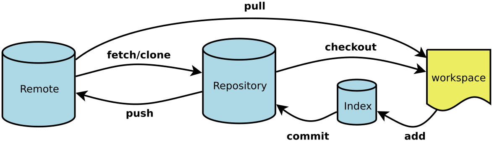

# Git 入门

## 设置git bash环境
- 光标颜色默认是白色，改为绿色
- 光标形状默认是下划线，改为块状
- 光标闪烁默认是闪烁，改为不闪
- 字体调大

## 设置git参数
```shell
#验证安装是否成功
git --version
#显示当前的git配置
git config --list
# 设置提交仓库时的用户名信息
git config --global user.name "chaijie"
# 设置提交仓库时的邮箱信息
git config --global user.email "1084163048@qq.com"
```

## Bash命令体验
```shell
#change directory
cd
#make directory
mkdir
#print working directory
pwd
#move
mv
#copy
cp
#remove
rm
```

## Git操作示意图

说明：
1. Workspace: 工作区
2. Index/Stage: 暂存区
3. Repository: 本地仓库区
4. Remote: 远程仓库，例如Github

## 新建代码仓库
```shell
#首先在GitHub上创建Repository
#然后clone到本地
git clone [https://github.com/[userName]]/reposName
```
## 查看信息
```shell
#显示变更信息
git status
#显示当前分支的历史版本
git log
git log --oneline
```

## 添加删除文件
```shell
#添加指定文件到暂存区
git add [file1] [file2]
#删除工作区文件，并且将这次删除放入暂存区
git rm [file1] [file2]
#改文件名，并且放入暂存区
git mv [file-origin] [file-renamed]
```
## 代码提交
```shell
#提交暂存区到仓库
git commit -m [message]
#直接从工作区提交到仓库，前提是该文件已有历史版本
git commit -a -m [message]
```

## 同步远程仓库
```shell
#将本地提交推送到远程仓库
git push
#将远程仓库下拉到本地
git pull
```
